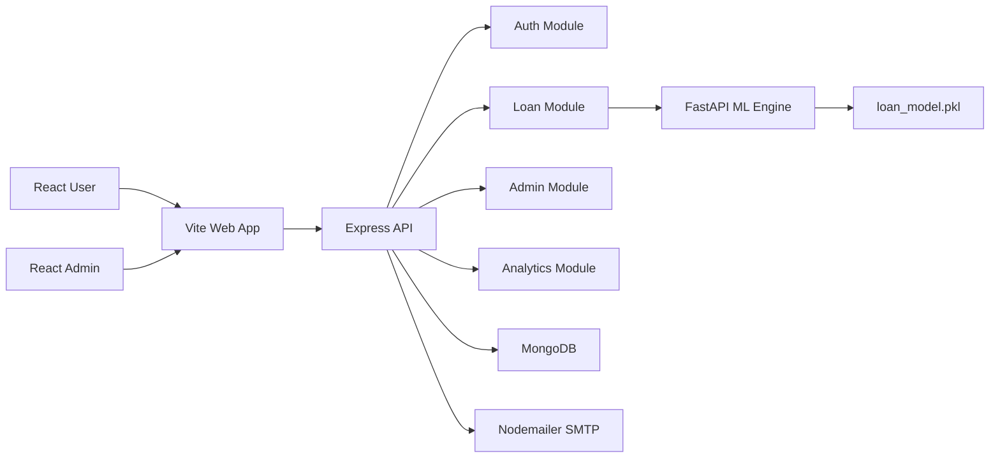

# Architecture

## Backend Flow

Routes call validation middleware, controllers, services, repositories, and then MongoDB. This keeps HTTP handling separate from business rules and persistence.

## ML Flow

The FastAPI service loads the trained model, scaler, label encoders, feature column order, and metadata at startup. `/predict` validates input, converts categorical features, scales features, predicts approval, returns confidence, and generates readable reasons.

## Security

- Password hashing with bcrypt.
- JWT access tokens.
- Protected routes via `protect`.
- Admin-only access via `adminOnly`.
- Express validation for auth, loan submission, and admin overrides.
- Helmet and CORS middleware.
